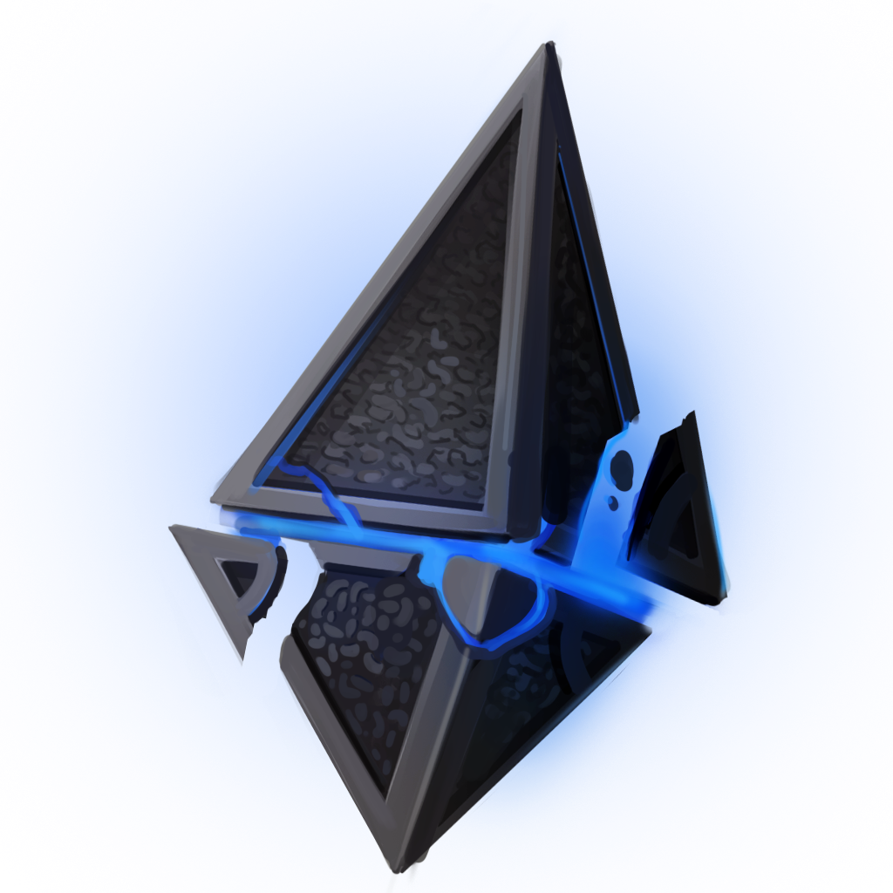

    

# Zendikar

Discord bot that provides RSS updates from selected resources and utility functions
to help manage active guilds.

### Main features

>RSS - lets users give themselves a role which allows them to see certain
channels that are receiving active RSS feeds. They subscribe to topics.

>Channel Purge - [ _future feature_ ] Lets admins quickly delete old messages.

### Commands

@everyone
- `/zendikar` : shows available commands and repo information
- `/ping` : check to see if bot is up
- `/rss` : lists the rss actions
- `/rss --list` : lists available rss channels
- `/rss --sub <channelName>` : subscribes you to the provided rss channel name
- `/rss --rm <channelName>` : un-subscribes you from the provided rss channel name

@admin
- `/rss-add <url>` : add this url source as an RSS resource
- `/rss-remove <url>` : remove this url from the RSS resouces

### Contributors

- [Erik Herbranson](https://www.github.com/erikherbranson)
